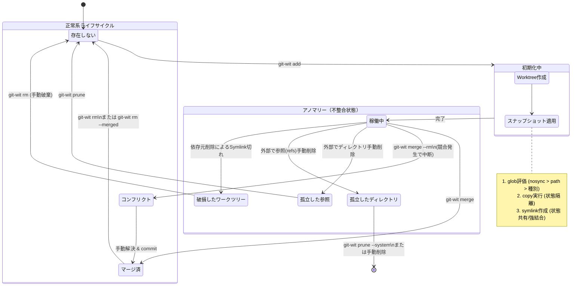

# Design Document: `git-wit` (Git Worktree with Isolated Tracking)

## 1. 概要 (Overview)

`git-wit` は、Git Worktree の管理を「名前（ブランチ名やディレクトリ名）」から「IDとメタデータ」による管理へとパラダイムシフトさせる個人向けのCLIツールである。
標準の `git worktree` が抱える命名の認知負荷やコンテキストの揮発を防ぐとともに、実務で発生する「新規ワークツリーセットアップ時の摩擦（`.env` や `node_modules` の欠落）」を、スナップショットベースのファイル同期によって解決する。一時的・並行的なタスクの分離を安全かつスケーラブルに行うことを目的とする。

## 2. 背景と課題 (Motivation)

標準の `git worktree` には以下のペインポイントが存在する。

1. **命名の認知負荷**: 一時的な作業（ちょっとしたバグ修正や検証）に対しても、一意で意味のあるディレクトリ名を考える必要がある。
2. **コンテキストの揮発**: 「なぜこのワークツリーを作ったか」「何の作業の途中か」というメタデータ（メモ）を保存する標準的な仕組みがない。
3. **ライフサイクルの管理**: 作業が終わった後のクリーンアップ（ディレクトリ削除、ブランチ削除）が煩雑。
4. **セットアップの摩擦 (状態の連続性の欠如)**: 新規ワークツリーを作成すると、Git管理外の必須ファイル（`.env`、ローカルの設定ファイル、巨大な `node_modules` やビルドキャッシュなど）が引き継がれず、都度インストールやコピーを行うタイムロスが発生する。

## 3. 目標と非目標 (Goals & Non-Goals)

### Goals

* ディレクトリ名に依存しない、IDベース（UUIDv7）のワークツリー生成。
* Git内部のオブジェクトストレージを利用したメタデータ（作業メモ等）の堅牢な保存。
* `git-wit add` 実行時における、Git管理外ファイル（ignored / untracked）のスナップショットベースでの同期（Copy / Symlink）。
* 状態空間の分離（SCCCの原則）に基づき、シェルの状態（カレントディレクトリ）に干渉しないクリーンなCLIの提供。
* 外部からの手動操作による不整合（ディレクトリの手動削除など）を許容する結果整合性（Eventual Consistency）の担保。

### Non-Goals

* **チーム共有の同期設定**: `git-wit` はあくまで「個人のローカル作業を最適化するツール」と位置づけ、設定は個人の `git config` に依存させる。プロジェクトごとの `.witconfig` のような独自ファイルのパースは行わない。
* **複雑なパターンマッチング**: `.gitignore` のような否定条件（`!foo`）や正規表現はサポートせず、`**` を含む単純な `glob` のみとする。
* **`modified`（Git追跡済みで未コミットの変更）の同期**: これはGit本来の責務（`stash` や `commit`）であり、ツール側でのファイルコピーで代行するとGitのインデックス状態と乖離するためサポートしない。
* **継続的なディレクトリ同期**: `git-wit add` 後の状態変更を監視・同期するデーモン機能は持たない。
* **ツール内部での `cd` の実装**: 各シェルのフックや環境依存コードの排除。
* **厳密なトランザクション管理**: Git自体の機能に委ね、ツール側での過剰なロールバック処理は実装しない。
* **既存ワークツリーの管理**: `git-wit` を経由せずに作られた標準ワークツリーは管理対象外とする。

## 4. アーキテクチャと状態空間 (Architecture & State Space)

状態（State）は以下のファイルシステムとGit内部データベースに分散して保持され、ツールはこれらの「結果整合性」を管理する。

### 4.0. 実装上の責務分割 (Implementation Locality)

LoB を保つため、実装は状態遷移を主軸にし、共有境界は最小限に固定する。

* `internal/wit/create`: `git-wit add` の状態遷移。ID 採番、metadata 保存、worktree 作成、初期同期、hook 実行を扱う。
* `internal/wit/query`: `git-wit ls` / `dir` / `id` / `memo` の読み取り系。managed worktree の一覧、逆引き、現在地解決、メモ参照を扱う。
* `internal/wit/integrate`: `git-wit merge` / `rm` の変更系。merge と削除を 1 つの lifecycle として扱う。
* `internal/wit/reconcile`: `git-wit prune` / `prune --system` の整合性回復。孤立 ref、孤立 dir、broken symlink の検出と修復を扱う。
* `internal/wit/catalog`: feature 共有の最小境界。repo discovery、worktree root、UUIDv7、`refs/git-wit/<ID>`、metadata JSON を扱う。
* `internal/wit/sync`: feature 共有の最小境界。`wit.*` の同期設定、ignored / untracked の収集、copy / symlink、add hook を扱う。
* `internal/cli`: Cobra の入出力と formatting のみを持ち、Git や metadata の直接操作は持たない。
* `internal/git`: git subprocess 実行だけを担う platform package。

この文書は高レベルの契約と状態モデルだけを持ち、各 package の局所 invariant は `internal/wit/*/doc.go` に置く。

### 4.1. データ構造の置き場所

1. **ファイルシステム (実体)**
    * パス: 既定では `$XDG_DATA_HOME/git-wit/worktrees/<UUIDv7>`。`XDG_DATA_HOME` 未設定時は `$HOME/.local/share/git-wit/worktrees/<UUIDv7>`。
    * 上書き: `git config wit.worktree.root <ABSOLUTE_PATH>` で配置先を変更できる。
    * 状態: `detached HEAD` の Git Worktree およびスナップショット適用済みのファイル群。

2. **Git Object Database (メタデータ)**
    * GitのBlobオブジェクトとしてJSON形式のメタデータを保存。
    * ポインタ: `refs/git-wit/<UUIDv7>` が対象のBlobオブジェクトを指す。

### 4.2. メタデータのスキーマ (JSON)

将来の拡張（ステータス、Issue URL、タグなど）の変更圧力に耐えるため、単なるテキストではなくJSONを採用する。未知のキーは無視する（前方互換性）パーサーを実装する。

```json
{
  "id": "0195e4d1-3d44-7a52-8e18-5f7b3c3d9a01",
  "created_at": "2026-03-13T10:00:00Z",
  "memo": "WIP: ログイン画面のバリデーション修正",
  "version": "1.0"
}

```

## 5. スナップショットと状態同期 (Snapshot & State Synchronization)

`git-wit add` 時に、親リポジトリから新規ワークツリーへ特定のファイルを同期する。ディスク容量の節約と速度の観点から `symlink` を許容するが、**Symlinkは状態（ミュータブルな実体）を共有するため、元ディレクトリへの強い結合を生む**というトレードオフをユーザーの自己責任として受け入れる。`git-wit` が生成する snapshot 用の Symlink は、親リポジトリ内の対象を絶対パスで指す。

### 5.1. 設定インターフェース (`git config`)

設定は `git config` の `wit.*` 名前空間を利用する。

```ini
[wit]
    # 全体種別に対するデフォルトの振る舞い (copy | symlink | none)
    ignored = none
    untracked = none
    # managed worktree の配置先
    worktree.root = /home/me/.local/share/git-wit/worktrees
[wit "nosync"]
    # 最優先で同期を除外するパス (glob, ** 可)
    path = tmp/*
    path = *.log
[wit "symlink"]
    # Symlinkとしてリンクを張るパス (glob, ** 可)
    path = node_modules
    path = .next
[wit "copy"]
    # 物理コピーするパス (glob, ** 可)
    path = **/node_modules
    path = .env.local
[wit "add"]
    # add 完了後に worktree dir を cwd として走る shell command string
    hook = npm run post-add
    hook = npm test

```

### 5.2. 評価ロジックと優先順位 (Resolution Tree)

推論可能性を担保するため、以下の順で評価を行い、最初にマッチした振る舞いを適用する。**パス指定（明示的）は種別指定（暗黙的）より優先される。**

1. **`wit.nosync.path`**: マッチすればスキップ（最優先）。
2. **`wit.symlink.path`**: マッチすればSymlinkを作成（※パス指定同士の競合時は、実利と速度を優先してSymlinkを勝ちとするか、定義順とする）。
3. **`wit.copy.path`**: マッチすれば再帰的にCopyを実行。
4. **種別評価 (`git status` の結果に基づく)**:
    * 対象が Git から `ignored` と判定された場合: `wit.ignored` の設定（`copy|symlink|none`）に従う。
    * 対象が Git から `untracked` と判定された場合: `wit.untracked` の設定（`copy|symlink|none`）に従う。

## 6. コマンドインターフェースと振る舞い (CLI Specifications)

### `git-wit add <memo>`

1. 時刻ソート可能なID（UUIDv7）を採番。
2. JSONメタデータを構築し、`git hash-object -w` でBlobとして保存。`git update-ref refs/git-wit/<ID> <BlobHash>` で参照を作成。
3. `git worktree add -d <Dir>/<ID>` で detached HEAD ワークツリーを作成。
4. **【同期フェーズ】**: 親リポジトリの `ignored` および `untracked` ファイルをリストアップし、上記「5.2」の評価ロジックに従って `copy` または `symlink` を適用する。
5. `[wit "add"] hook` を設定順に shell command string として実行し、各コマンドの `cwd` は新規 worktree とする。最初の失敗で中断し、既存の worktree や metadata は巻き戻さない。
6. 出力: 生成されたIDとパス。

### `git-wit ls`

1. `git for-each-ref refs/git-wit/` で一覧を取得し、各BlobからJSONをパースして一覧表示。
2. **【付加情報】**: 各 worktree のディレクトリに対して個別に `git symbolic-ref --short -q HEAD`（ブランチ名。detached HEAD の場合は空）と `git rev-parse --short HEAD`（HEADのコミットハッシュ）を実行し、`ID / 作成日時 / パス / メモ / ブランチ / HEAD / PR番号 / 状態` をタブ区切りで出力する。取得できない項目（未検出のブランチや PR、状態）は `-` で表示する。
3. **【PR番号と状態の解決】**: ブランチが存在する場合に限り、ローカルにインストールされた `gh` CLI（`gh pr view <branch> --json number,state,isDraft,headRefOid`）を worktree のディレクトリで実行し、そのブランチに紐づく Pull Request 番号、状態、head commit を解決するベストエフォートの付加情報とする。状態は `Open` / `Draft` / `Merged` / `Closed` のいずれかとし、wit の HEAD がコマンド実行時の cwd の HEAD に含まれる場合は PR の状態より優先して `Merged` とする。`gh` が未インストール、未認証、対象ブランチに PR が無い等の場合でもコマンド全体は失敗させない。
4. **【状態監視】**: Symlinkを多用している場合、親ディレクトリの削除等による「Symlink切れ（Broken Link）」という隠れ状態のリスクがある。対象ワークツリーの健全性チェックを非同期で行い、破損があれば警告マーク（例: `[!]`）を付与する。

### `git-wit id`

現在のディレクトリが managed worktree 配下にある場合、その worktree の ID を標準出力に返す。`git-wit dir <id>` の逆引きとして使う。

### `git-wit dir <id>`

指定されたIDに紐づくワークツリーの絶対パスを標準出力に返すのみ。ユーザーは `cd $(git-wit dir <id>)` のように利用する。

### `git-wit memo [id]`

指定されたIDに紐づく `git-wit add` 登録時のメモを標準出力に返す。`id` を省略した場合は `git-wit id` と同様にカレントディレクトリから managed worktree を解決し、そのメモを返す。

### `git-wit rm <id>`

1. `git worktree remove <Dir>/<ID>` を実行。
2. `git update-ref -d refs/git-wit/<ID>` で参照を削除。

### `git-wit rm --merged [--yes]`

安全に統合済みと判断できる managed worktree を作成日時の古い順（同時刻は ID 順）に一括削除する。ID 指定と `--merged` は排他とし、`--yes` は `--merged` とだけ併用できる。

1. worktree の HEAD がコマンド実行元の HEAD の祖先であるか、関連 PR が `MERGED` かつ worktree の HEAD が PR の `headRefOid` と一致するものを候補とする。実行元自身が managed worktree の場合は候補から除外する。
2. 候補を `merged\t<ID>\t<path>` で標準出力へ表示する。候補がなければ無出力で成功終了する。
3. `--yes` がなければ削除前に `[y/N]` で確認する。非対話入力では `--yes` を必須とし、確認を拒否した場合は削除せず成功終了する。
4. 各候補は削除直前に条件を再評価する。条件から外れた候補や未コミット変更がある候補は削除しない。
5. 1 件の失敗後も残りを処理する。成功は `removed\t<ID>` を標準出力、失敗は `failed\t<ID>\t<error>` を標準エラーへ出力し、1 件以上失敗した場合は最終的に非ゼロ終了する。

### `git-wit merge <id> [--rm]`

1. 現在のブランチに対して、指定IDのワークツリーのHEADをマージ（`git merge`）。
2. コンフリクトが発生した場合、操作を即座に中断し、エラーコードを返す。
3. `--rm` オプションがあり、かつマージが成功した場合のみ、内部的に `git-wit rm <id>` を呼び出してクリーンアップを行う。

### `git-wit prune` (異常系リカバリ)

以下の「孤立状態・不整合状態」を検知し、状態を同期・修復する。

1. **孤立した参照**: `refs/git-wit/<ID>` は存在するが実ディレクトリが存在しない（手動 `rm -rf` された）場合 → 参照を削除。
2. **孤立したディレクトリ**: ディレクトリは存在するが `refs/git-wit/<ID>` が存在しない（手動 `update-ref -d` された）場合 → 警告を出力し、手動削除を促す。
3. **Symlink破損**: `git-wit add` 時に作成したSymlinkのリンク先が存在しない場合、ユーザーに警告を出し、手動修復または `rm` を促す。

### `git-wit prune --system [--yes]`

configured な managed worktree root 全体を走査し、`git rev-parse --show-toplevel` で所有 repo を特定できない worktree directory だけを孤児として扱う。

1. 対象は worktree root 直下の UUIDv7 名ディレクトリのみ。
2. 所有 repo を特定できた worktree には触れない。`refs/git-wit/<ID>` の有無にも介入しない。
3. 所有 repo を特定できないディレクトリだけを削除候補として列挙する。
4. `--yes` なしでは確認プロンプトを出し、非対話入力ではエラーにする。
5. 実行時はディレクトリのみを削除し、ref は削除しない。

## 7. 状態遷移図 (State Machine)

`git-wit` が管轄する「ワークツリーとメタデータ参照」のライフサイクル。



## 8. 設計上の重要な決定とトレードオフ (Design Decisions)

### 8.1. シェル連携の排除 (`cd` ではなく `dir` を提供)

* **決定**: ツール自体でカレントディレクトリを移動する機能を持たない。
* **理由**: シェルの状態はツールの外部にある強固なミュータブル状態である。各シェル（bash, zsh, fish, pwsh）ごとのサポートを組み込むと、結合度と複雑性が跳ね上がる。
* **トレードオフ**: ユーザーはエイリアスやシェル関数を自作する必要がある。

### 8.2. 厳密な同期処理の放棄（結果整合性の採用と `prune`）

* **決定**: `ls` などの実行時に、毎度ディレクトリの実在と Git refs の完全な整合性チェック・修復を行わない。
* **理由**: Git操作のパフォーマンス劣化を防ぐため。ユーザーがGit標準コマンドで介入可能な以上、ロックアウトによる厳密な状態管理は不可能。
* **トレードオフ**: 一時的な隠れ状態が発生し得るが、`prune` コマンドでリカバリ可能とする。

### 8.3. メタデータの Blob + JSON 化

* **決定**: メタデータをコミットメッセージ等ではなく、`refs/git-wit/` 空間のポインタと Blob で管理する。
* **理由**: detached HEAD との相性の良さと、将来的なスキーマ拡張（後方互換性）への対応。

### 8.3.1. ID フォーマットの固定（UUIDv7）

* **決定**: worktree ID は canonical な UUIDv7 文字列に固定する。
* **理由**: 時系列ソート可能でありつつ、既存の UUID エコシステムと整合するため。
* **トレードオフ**: ID は ULID より長くなるが、互換レイヤーを持たない実装にすることで複雑性を抑える。

### 8.4. `modified` ファイルのコピーの除外（SRPの徹底）

* **決定**: 未コミットの変更の物理コピーでの移送を棄却した。
* **理由**: Gitが管理する「インデックス」という複雑な状態空間をファイルコピーで模倣することは不可能であり、Git本来の責務との混線（SRP違反）を引き起こすため。

### 8.5. Symlinkの許容と「結合度」のトレードオフ

* **決定**: SCCC原則におけるアンチパターンであるSymlinkをあえて許容する。
* **理由**: 「個人用のCLIツール」というコンテキストと「`node_modules` の再生成にかかる膨大な時間」という実務上のペインを天秤にかけ、実利（Pragmatism）を優先した。代償のアノマリーは `prune` で緩和する。

### 8.6. 複雑性の排除（単純な `glob` の採用）

* **決定**: `.gitignore` 形式の完全互換（否定条件 `!` 等）や正規表現はサポートしない。一方で、`**` を使う再帰 glob は許容する。
* **理由**: 評価ロジックの複雑性を抑えつつ、`node_modules` のような深い階層の除外・コピー指定には `**` が実用上必要になるため。個人的なユースケースではこの範囲で十分に要件を満たせる。

## 9. 将来の拡張性 (Future Enhancements)

現在のアーキテクチャを壊さずに実現可能なロードマップ案。

* **TUI (Terminal UI) 連携**: `ls` の出力を `fzf` や `peco` にパイプし、選択したIDを `git-wit dir` に渡して対話的にディレクトリ移動するラッパースクリプトの提供。
* **メタデータの拡張**: JSONスキーマの更新による、Issue Tracker (Jira / GitHub Issues) のURL紐付け機能。
* **退避と再開**: 一時的な作業をコミットせずに、`stash` のように扱いながらディレクトリごと隔離するフローの洗練。
